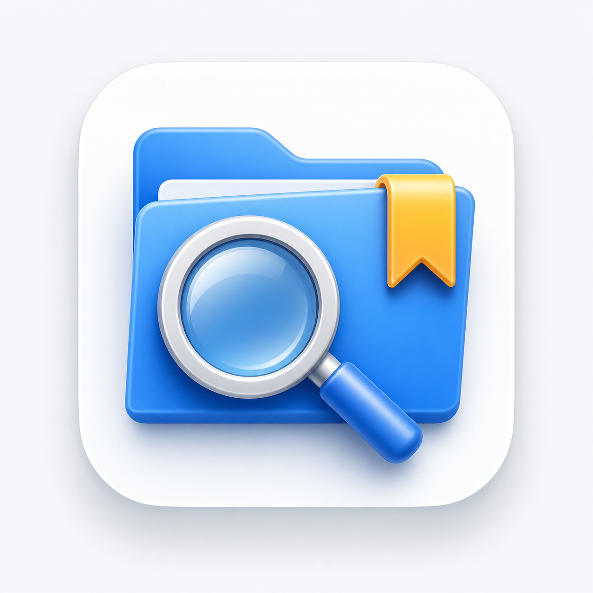

# SaveSearch

[](https://github.com/vvangpc/save-search/actions/workflows/ci.yml)
[](LICENSE)

> Windows 10/11 常驻托盘小工具：NTFS 毫秒级文件搜索 + 「保存/打开」对话框位置快选。

SaveSearch 用 **Rust + [windows-rs](https://github.com/microsoft/windows-rs)** 编写，单 exe（约 0.6 MB，
`+crt-static` 静态链接、无运行时依赖），常驻系统托盘，提供两大功能：

1. **指定盘符快速搜索** —— 基于 NTFS MFT 的毫秒级文件 / 文件夹搜索（类似 Everything）。
2. **保存位置快速选择** —— 任何程序弹出「保存 / 打开 / 上传文件」对话框时，在对话框**下方**弹出浮窗，
   列出「当前已打开的资源管理器文件夹 + 收藏夹 + 最近位置」，单击即跳转到该目录。

功能 2 全程**进程外**实现（`SetWinEventHook` + UI Automation，**不注入 DLL**），界面为原生 Win32 自绘，支持多主题。

---

## ✨ 功能特性

### 🔍 快速搜索
- **多盘索引**：运行时自动识别所有固定 NTFS 盘（不限 C/D），毫秒级、大小写不敏感的子串搜索。
- **搜索范围**：全部盘 / 指定盘符 / **预设文件夹**（在设置中添加，仅搜索该文件夹子树）；范围下拉框按文本长度自适应宽度。
- **分类筛选**：全部 / 文件夹 / 文档 / 图片 / 压缩包 / 其他（音视频归入「其他」）。
- **秒开缓存**：索引落盘缓存，二次启动无需重新全盘扫描（实测约 2.8s → 0.16s）。
- **实时增量**：USN 日志每 2 秒增量更新，文件增 / 删 / 改几秒内反映到结果；
  长期运行自动回收已删节点（墓碑超阈值时后台整盘重建，内存不随时间无限增长）。
- **全局热键** `Alt + Space` 弹出 / 隐藏搜索框；回车或双击在资源管理器中定位。
- **自绘双行结果**（真实文件类型图标 + 文件名 + 灰色路径）+ **逐像素平滑滚动**（惯性缓动、整窗双缓冲、悬停即可滚、方向键导航）。

### 📌 保存位置快选
- `SetWinEventHook` 检测系统文件对话框（窗口类 `#32770`）。
- `IShellWindows` 枚举当前已打开的资源管理器窗口及其文件夹。
- 浮窗按固定优先级列出 **收藏 → 已打开 → 最近**（同一路径只保留最高优先级、去重）。
- **自动刷新**：对话框开着时去资源管理器新打开文件夹，切回对话框浮窗即自动出现该文件夹——无需关框重开
  （条目未变时不重绘，保留选中项、不闪烁）。
- 单击经 UI Automation 让对话框切换到该文件夹（模拟键入路径，**不会误改文件名**；
  跨进程消息均带超时，目标程序卡死也不影响本工具；恢复文件名前校验内容，不覆盖用户刚输入的名字）。
- 右键浮窗项可收藏 / 取消收藏；浮窗相对对话框居中并随其移动；对话框失焦 / 关闭即隐藏；
  对话框贴近屏幕底部时浮窗自动改显示在其上方（多显示器工作区钳制）。
- 各分类项带来源标记（★ 收藏 / 最近）。

### ⚙️ 设置与外观
- 托盘「设置…」：主题、索引盘符、**预设文件夹**（系统文件夹选择器增删）、开机自启（计划任务，免 UAC）、
  结果上限、最近条数、浮窗总开关与三类显示项（收藏 / 已打开 / 最近）。
- **主题**：商务浅色 / 商务深色 / 暖阳浅色；Windows 11 下标题栏随主题着色（DWM）。
- 自有应用图标（exe / 托盘 / 窗口标题栏）；分类按钮带 Segoe MDL2 Assets 小图标，窄窗时自动降级为纯图标。

---

## 💻 系统要求
- Windows 10（1607 及以上）/ Windows 11，**x64**。
- 需以**管理员**身份运行（读取 NTFS MFT / USN 日志需要卷句柄），启动时会弹 UAC。

## 📦 安装

### 方式一：下载预编译版（推荐）
前往 [Releases](https://github.com/vvangpc/save-search/releases) 下载 `SaveSearch-vX.Y.zip`，
解压得到 `ss-app.exe`，双击运行（UAC 点「是」）。程序驻留托盘，无需安装。

### 方式二：从源码构建
前置：Rust `stable-x86_64-pc-windows-msvc` 工具链 + Visual Studio Build Tools（含 Windows SDK 的 `rc.exe`）。

```powershell
cargo build --release
```

产物：`target/release/ss-app.exe`（已内嵌 `requireAdministrator` 清单 + 应用图标）。

> 注：仓库根 `rust-toolchain.toml` 已固定 `stable` + `x86_64-pc-windows-msvc`，首次构建 rustup 会自动准备。

## 🚀 使用
1. 启动后程序驻留**系统托盘**（托盘图标即应用图标）。
2. 按 `Alt + Space` 打开搜索窗，输入关键字即时搜索；用顶部标签切换分类、用右侧下拉切换范围；
   回车或双击结果在资源管理器中定位；`Esc` 隐藏。
3. 在任意程序里触发「保存 / 打开 / 上传」对话框，其**下方**会出现浮窗：单击某项跳转到该目录，右键收藏 / 取消收藏。
4. **托盘右键菜单**：打开搜索 / 设置… / 退出。

## 🗂️ 数据目录
| 内容 | 路径 |
|---|---|
| 索引缓存 | `%LOCALAPPDATA%\SaveSearch\cache\index_*.ssidx` |
| 收藏夹 / 最近位置 / 设置 | `%APPDATA%\SaveSearch\{favorites,recent,settings}.json` |

配置与索引均为**原子写**（写临时文件 → `fsync` 落盘 → 替换），避免崩溃 / 断电留下损坏文件。
JSON 配置若仍意外损坏，会被改名保留为 `*.json.corrupt-<时间戳>`（而非静默丢弃），收藏 / 设置不会被覆盖丢失。

## 🏗️ 架构

Cargo workspace 多 crate：

| crate | 职责 |
|---|---|
| `ss-platform` | Win32 薄封装：宽字符串、COM 初始化 guard |
| `ss-core` | 索引引擎：MFT 枚举、USN 增量、紧凑索引、搜索、分类、文件夹子树搜索、磁盘缓存 |
| `ss-shell` | 功能 2：WinEvent 钩子、`IShellWindows` 枚举、UI Automation 对话框导航 |
| `ss-config` | 设置 / 收藏夹 / 最近位置（JSON，原子写） |
| `ss-app` | 可执行文件：托盘、热键、消息主循环、线程编排、搜索窗（自绘平滑列表）、对话框浮窗、设置窗、主题、图标 |

发布构建采用体积优先 profile：`opt-level="z"` + `lto="fat"` + `codegen-units=1` + `panic="abort"` + `strip`。

## 🛠️ 开发

```powershell
# 运行库 crate 的单元测试（ss-app 因内嵌管理员清单设 test = false，不参与 cargo test）
cargo test

# 索引引擎示例（需管理员）
cargo run -p ss-core --example scan
cargo run -p ss-core --example cache
cargo run -p ss-shell --example folders

# 从源图重新生成应用图标 app.ico（需 Python + Pillow）
python tools/make_icon.py
```

应用图标由 `tools/make_icon.py` 从 `assets/generated/savesearch-app-icon-concept.png` 抠出透明圆角、
导出多尺寸（16/20/24/32/48/64/128/256）写入 `crates/ss-app/app.ico`，再经 `build.rs` + `embed-resource`
连同 `app.manifest` 编入 exe。

## 🤖 CI / 发布
- [`.github/workflows/ci.yml`](.github/workflows/ci.yml)：每次 push / PR 在 `windows-latest` 上
  `cargo build --release` + `cargo test`，并上传 `ss-app.exe` 为构建产物。
- 推送 `vX.Y` 形式的 tag → 自动构建并创建 **GitHub Release**，附带 `ss-app.exe` 与打包 zip。

发版流程：

```powershell
git tag v0.1
git push origin v0.1
```

## 📋 已知限制 / 路线图
- 仅索引 **NTFS 固定盘**；FAT32 / exFAT / U 盘暂不支持。
- 计划中：Inno Setup 安装包、代码签名（需证书）、非 NTFS 盘降级方案。

## 📄 许可证
[MIT](LICENSE)。
